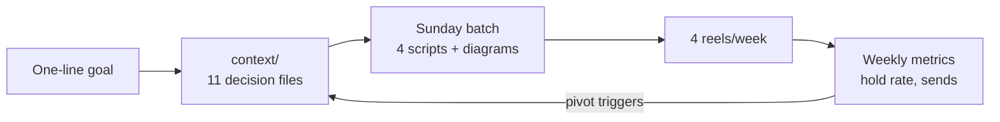
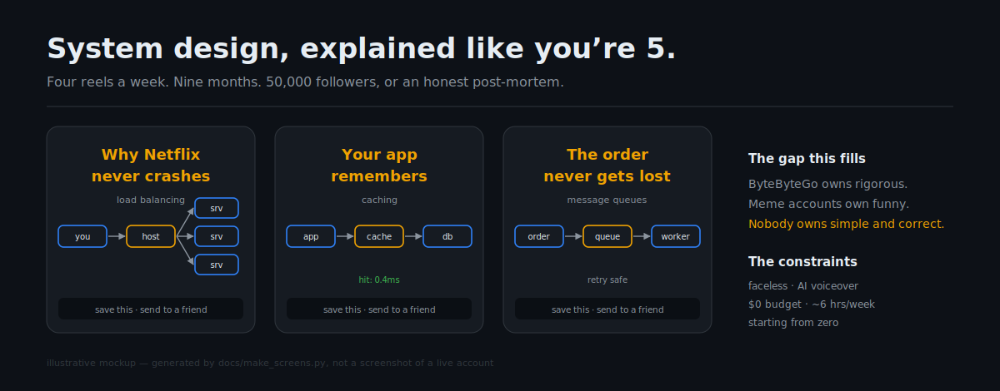
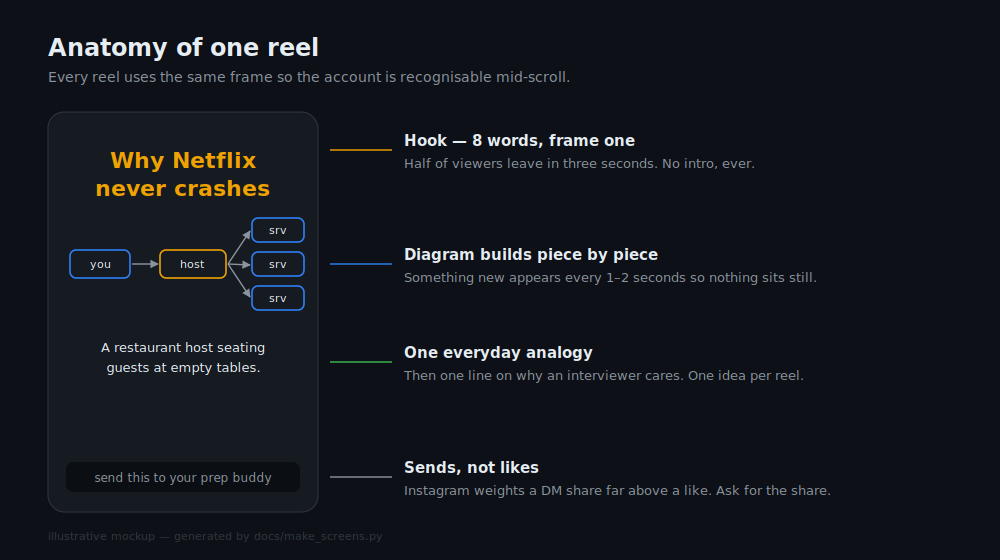
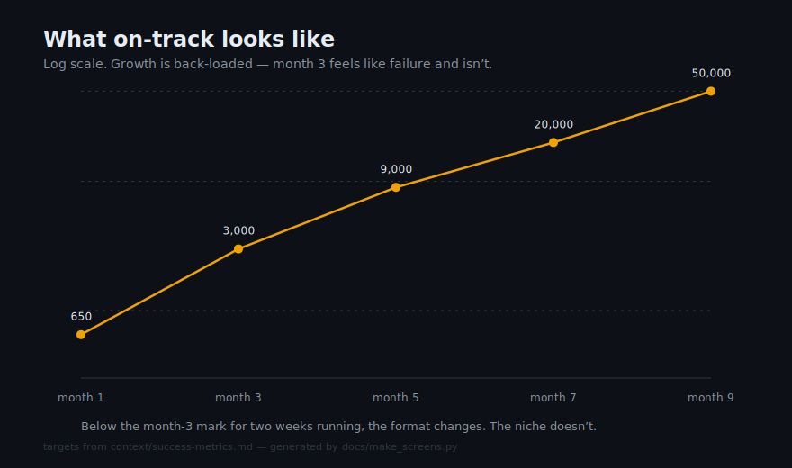
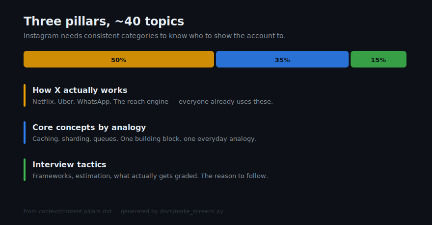

# Context for a system design Instagram channel

I want to build an Instagram channel that explains high-level system design to CS students, and get it to 50,000 followers in nine months posting four reels a week.

That one sentence is the whole goal. It's also nowhere near enough to actually act on.

This repo is what happened when I took that sentence and tried to answer everything it left out — who exactly I'm making this for, what I'm competing against, what I can realistically produce on five hours a week with no budget, and how I'll know if it's working before month nine tells me it wasn't.

## Why this exists

Most content plans fail quietly. Not because the idea was bad, but because a dozen decisions were never made and get re-litigated every single week. Should this reel be beginner-friendly or rigorous? Is 800 followers in month two fine or a disaster? Do I chase the trending audio or not?

Writing the answers down once means I stop deciding and start shipping. It also means someone else — a collaborator, an editor, an AI assistant — can pick this up and produce work that fits, without a call.

## What's in here

Everything lives in [`context/`](./context), one topic per file. Start with the [index](./context/README.md).

The short version:

- **The goal** — 50k in 9 months, 4 reels/week, starting from absolutely zero
- **Me** — working engineer, faceless channel, AI voiceover only, ~5–8 hrs/week, $0 budget
- **The audience** — people prepping for system design interviews, mostly US/global, who watch on mute and save more than they comment
- **The wedge** — ByteByteGo owns rigorous. Meme accounts own funny. Nobody owns *simple and trustworthy*. That's the gap
- **The bar** — what has to be true before a reel ships
- **The plan** — pillars, ~40 topics, a weekly workflow that fits the hours I actually have
- **The metrics** — a month-by-month curve and the specific numbers that trigger a pivot

## How it works

The loop is simple enough to hold in your head. A one-line goal gets expanded into eleven context files. Those files answer every question the weekly production run would otherwise have to stop and ask. Reels ship on a fixed cadence, the numbers come back, and the numbers feed back into the context — not into a weekly argument with myself.

The only arrow that matters is the last one. Most content plans are written once and never touched again; this one has specific numbers attached to specific dates, and when they're missed the plan changes rather than the effort doubling.

## What it looks like

Nothing has shipped yet, so these aren't screenshots — they're mockups drawn from the visual identity in `context/format-production.md` and the numbers in `context/success-metrics.md`. They exist so the plan is legible at a glance instead of only as prose.

Every reel is built from the same four parts, in the same order, so the account is recognisable mid-scroll:

The follower targets, on a log scale — which is the only honest way to draw them, because the curve is back-loaded and month three looks like failure if you plot it linearly:

And the topic mix, weighted so the algorithm gets consistent categories to file the account under:

All four are generated by [`docs/make_screens.py`](docs/make_screens.py) — plain SVG, no dependencies. Run `python3 docs/make_screens.py` from the repo root to regenerate them after the numbers change.

## The roadmap

[`ROADMAP.md`](./ROADMAP.md) breaks the nine months into four phases, each with a target, the work that phase is actually for, and the specific number at which I've agreed in advance to change the format instead of trying harder at the same one.

## The honest part

50,000 followers in nine months from a standing start is at the ambitious end of what the benchmarks support. Comparable faceless accounts typically take six to twelve months. Hitting the low end requires never missing a week and getting two to four reels that genuinely break out — and breakouts aren't fully in my control.

I'd rather write that down now than discover it in month seven. The pivot triggers in `success-metrics.md` exist for exactly that reason.

## A note on how this was built

The research here — competitor sizes, algorithm behaviour, growth benchmarks, tool options — was gathered in July 2026. Platform mechanics change fast. Follower counts and ranking signals are worth re-checking before anyone leans on them.

The decisions here, though, are mine. The research just made them cheaper to make.

## Using this

Public so it can be read, licensed so it can't be resold. Everything here is under [CC BY-NC-ND 4.0](./LICENSE).

Borrow the approach freely — that's the point of publishing it. If you quote or reference the files, credit and a link back are all I ask. What's not on the table is packaging this into a paid product or republishing an edited version as your own.

If you want to adapt it commercially, just ask me.
